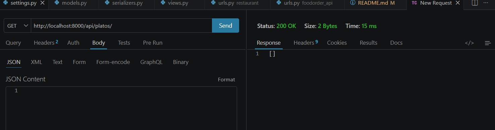
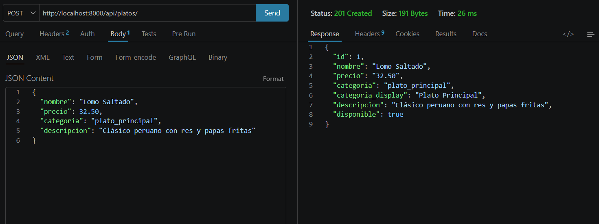
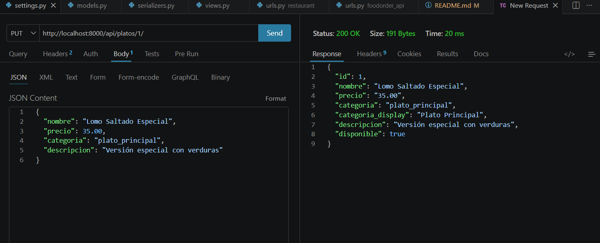
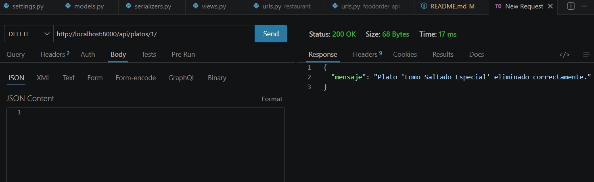
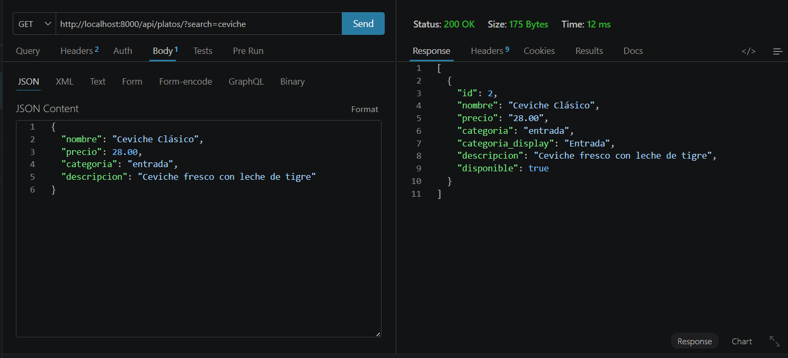
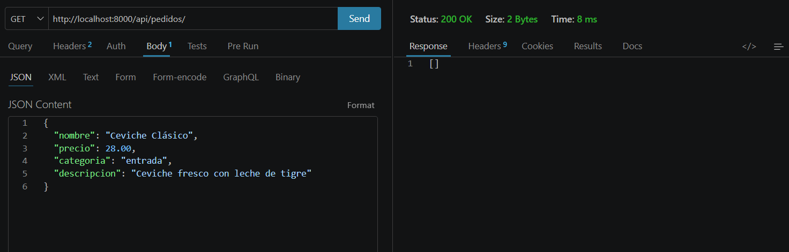
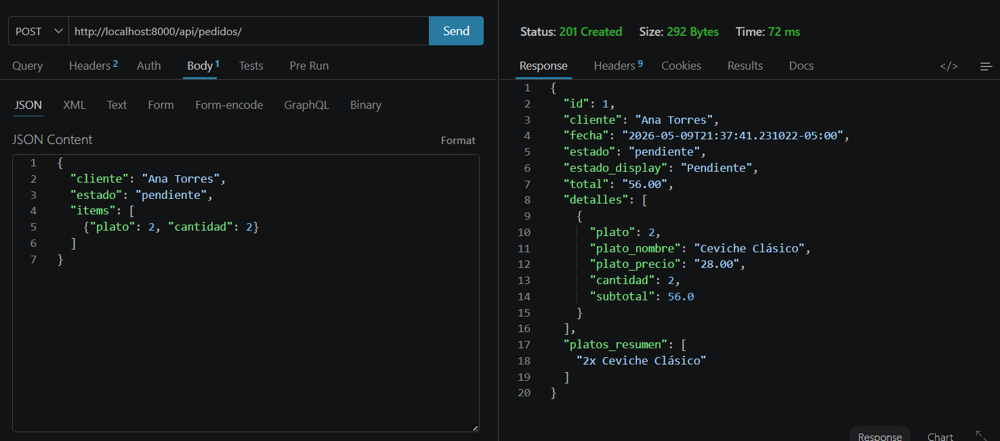

# 🍔 FoodOrder API

API REST para gestión de restaurante construida con Django + Django REST Framework.

---

## 📋 Descripción

Sistema backend para administrar el menú y los pedidos de un restaurante.
Permite crear, listar, editar y eliminar platos y pedidos, con relación Many-to-Many entre ambos.

---

## 🛠 Tecnologías usadas

| Tecnología | Versión |
|---|---|
| Python | 3.13 |
| Django | 4.x |
| Django REST Framework | 3.x |
| django-filter | 23.x |
| SQLite | (incluido) |

---

## 🚀 Instrucciones para ejecutar el servidor

### 1. Clonar el repositorio
```bash
git clone https://github.com/alexandersanabria-lang/foodorder_api.git
cd foodorder_api
```

### 2. Crear entorno virtual
```bash
python -m venv venv
venv\Scripts\activate
```

### 3. Instalar dependencias
```bash
pip install django djangorestframework django-filter
```

### 4. Aplicar migraciones
```bash
python manage.py migrate
```

### 5. Ejecutar servidor
```bash
python manage.py runserver
```

La API estará disponible en: `http://localhost:8000/api/`

---

## 📡 Endpoints disponibles

### 🍽 Platos

| Método | Endpoint | Descripción |
|---|---|---|
| GET | `/api/platos/` | Lista todos los platos |
| POST | `/api/platos/` | Crea un nuevo plato |
| PUT | `/api/platos/{id}/` | Actualiza un plato |
| DELETE | `/api/platos/{id}/` | Elimina un plato |
| GET | `/api/platos/?search=nombre` | Busca platos |

### 📦 Pedidos

| Método | Endpoint | Descripción |
|---|---|---|
| GET | `/api/pedidos/` | Lista todos los pedidos |
| POST | `/api/pedidos/` | Crea un nuevo pedido |
| PUT | `/api/pedidos/{id}/` | Actualiza un pedido |
| DELETE | `/api/pedidos/{id}/` | Elimina un pedido |
| GET | `/api/pedidos/?search=cliente` | Busca pedidos |

---

## 🖼 Capturas de pantalla

### GET - Listar platos


### POST - Crear plato


### PUT - Editar plato


### DELETE - Eliminar plato


### GET - Buscar plato


### GET - Listar pedidos (con relación a platos)


### POST - Crear pedido
